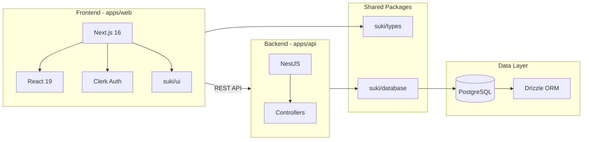
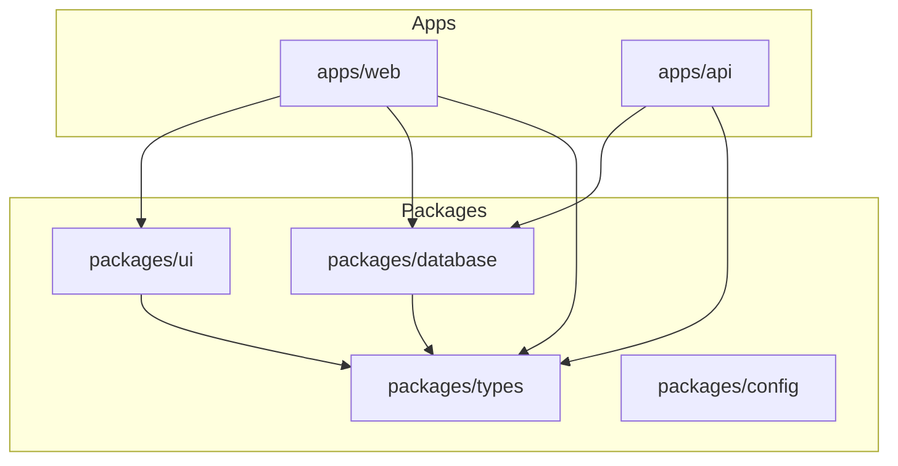

# System Architecture Overview

## Project Type

**Suki** is a full-stack monorepo built with Turborepo.

- **Frontend**: Next.js 16 (App Router), React 19
- **Backend**: NestJS 10, Express
- **Database**: PostgreSQL with Drizzle ORM
- **Auth**: Clerk

## Application Flow



## Module Relationships



## Directory Structure

```
suki/
├── apps/
│   ├── web/          # Next.js frontend
│   │   └── src/
│   │       └── app/   # App Router
│   └── api/          # NestJS backend
│       └── src/
├── packages/
│   ├── ui/           # Shared React components
│   ├── database/     # Drizzle schema, migrations
│   ├── types/        # Shared TypeScript types
│   └── config/       # Shared TS config
├── turbo.json
└── package.json
```

## Key Architectural Decisions

1. **Monorepo**: Turborepo for build orchestration and shared packages
2. **Workspace packages**: @suki/ui, @suki/database, @suki/types used by both apps
3. **Database sharing**: Single @suki/database package with Drizzle schema
4. **Auth**: Clerk for frontend auth; backend validates tokens
5. **Type safety**: Shared @suki/types across frontend and backend
