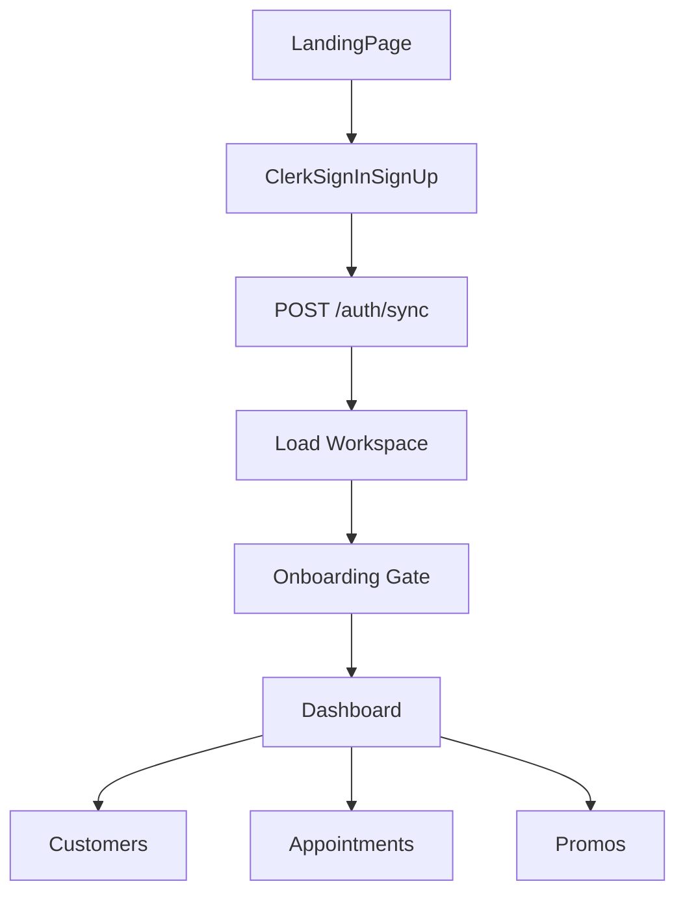
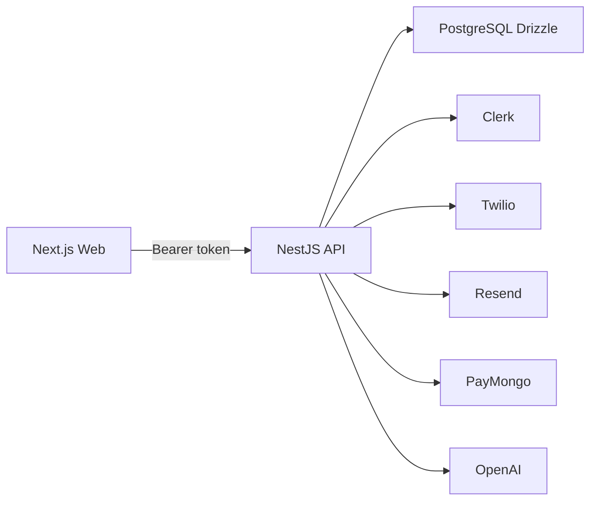
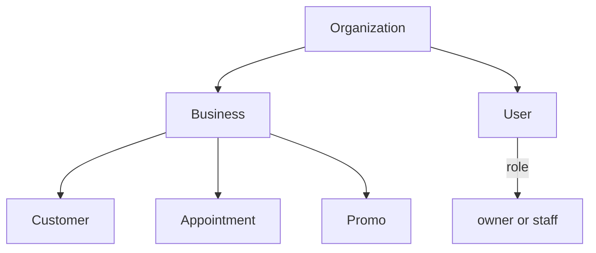
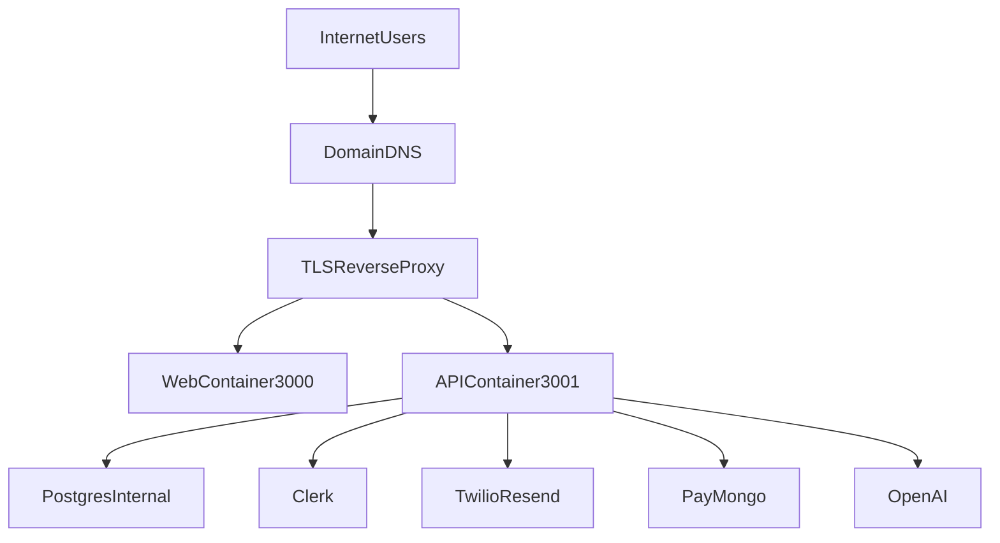

# Suki — App Flow, Technical Reference, and Cloud Decision Pack

A decision-grade document for product flows, technical architecture, and cloud/VPS access readiness. Use this as the basis for decisions when enabling user access on cloud infrastructure (e.g., VPS).

---

## 1. Audience and Purpose

| Audience | Use |
|----------|-----|
| **Product** | Understand user journeys, feature capabilities, and onboarding flow |
| **Engineering** | Auth flow, API surface, data model, deployment topology |
| **Operations / Decision-makers** | Cloud architecture options, security controls, risk matrix, go/no-go checklist |

This doc is both a product walkthrough and a launch/readiness decision artifact.

---

## 2. At-a-Glance Capabilities

### Public Routes (no auth required)

| Route | Purpose |
|-------|---------|
| `/` | Landing page: marketing, pricing, FAQs |
| `/sign-in` | Clerk sign-in (redirects to `/dashboard` when signed in) |
| `/sign-up` | Clerk sign-up (redirects to `/dashboard` when signed up) |
| `/intake/[businessId]` | Public customer intake form for a business |

### Protected Routes (Clerk auth required)

Enforced by `clerkMiddleware` in `apps/web/src/middleware.ts`:

| Route pattern | Purpose |
|---------------|---------|
| `/dashboard(.*)` | Dashboard with metrics, recent activity, QR block |
| `/customers(.*)` | Customer list, add/edit, visits, message history |
| `/appointments(.*)` | Appointment list, create/edit, status, reminders |
| `/promos(.*)` | Promo campaigns, AI-assisted messages, send to customers |
| `/settings(.*)` | Account settings |
| `/setup(.*)` | Business setup |
| `/onboarding(.*)` | 8-step onboarding wizard |

Additional dashboard routes (insights, loyalty, imports, and optional pipeline) are rendered under the dashboard layout; access is typically gated by the same auth context.

---

## 3. User Journey (Happy Path)

### Flow Detail

1. **Landing** (`/`) — Public marketing page. Header shows "Sign in" or "Go to Dashboard" when signed in.
2. **Sign Up / Sign In** (`/sign-up`, `/sign-in`) — Clerk-hosted UI. On success, redirects to `/dashboard`.
3. **Auth Sync** — `useAuthSync` calls `POST /auth/sync` with Bearer token. Backend creates/retrieves user and organization, returns tenant context.
4. **Workspace Load** — `WorkspaceProvider` fetches businesses and active business via `GET /users/me/workspace`.
5. **Onboarding Gate** — `OnboardingGate` checks `GET /onboarding/progress`:
   - If incomplete → redirects to `/onboarding`
   - Legacy users (existing businesses + data) auto-complete onboarding
   - If complete → allows access to dashboard routes
6. **Onboarding Wizard** — 8 steps (see Section 5).
7. **Dashboard** — Metrics, activity feed, QR block, next-step prompts.
8. **Core Features** — Customers, Appointments, Promos, Insights, Loyalty, Import, Setup, Settings.

---

## 4. Clerk Authentication Deep Dive

### Frontend

| Component | File | Responsibility |
|-----------|------|----------------|
| Middleware | `apps/web/src/middleware.ts` | Route matchers: public vs protected. Calls `auth.protect()` for protected routes when Clerk is configured |
| Sign-in page | `apps/web/src/app/sign-in/[[...sign-in]]/page.tsx` | Renders Clerk `<SignIn>` with `forceRedirectUrl="/dashboard"` |
| Sign-up page | `apps/web/src/app/sign-up/[[...sign-up]]/page.tsx` | Renders Clerk `<SignUp>` with `forceRedirectUrl="/dashboard"` |
| Auth sync hook | `apps/web/src/hooks/use-auth-sync.ts` | Calls `POST /auth/sync` with `getToken()`, caches result, retries on failure |

### Token Flow

1. User signs in via Clerk; Clerk issues JWT.
2. Frontend calls `getToken()` from `useAuth()`.
3. `apiRequest()` in `apps/web/src/lib/api.ts` adds `Authorization: Bearer <token>` to API calls.
4. API base URL: `NEXT_PUBLIC_API_URL` (default `http://localhost:3001`).

### Backend

| Component | File | Responsibility |
|-----------|------|----------------|
| Auth controller | `apps/api/src/auth/auth.controller.ts` | `POST /auth/sync` — verifies token, calls `AuthService.syncUser()` |
| Auth service | `apps/api/src/auth/auth.service.ts` | `verifyToken()` via `@clerk/backend`; `syncUser()` creates org + user if new, returns existing otherwise |
| Clerk auth guard | `apps/api/src/auth/clerk-auth.guard.ts` | Extracts Bearer token, verifies via `AuthService`, looks up user by `clerkId`, injects `tenant` into request |
| Tenant context | `request.tenant` | `{ organizationId, userId, role: "owner" \| "staff" }` |

Protected API endpoints use `ClerkAuthGuard`. If token is invalid or user is not synced, the guard throws `UnauthorizedException` with "User not synced. Call POST /auth/sync first."

---

## 5. Feature Flows Users Can Perform

### Onboarding Wizard (8 steps)

| Step | Title | Action |
|------|-------|--------|
| 1 | Set up your business | Create first business (name, type) |
| 2 | Your daily dashboard | Preview dashboard (can skip) |
| 3 | Add your first customer | Name + optional mobile |
| 4 | Record a visit | Select customer, record visit |
| 5 | Add an appointment | Select customer, date/time |
| 6 | Create your first offer | Promo type, value, message |
| 7 | Set your customer rewards | Loyalty threshold (visits before reward) |
| 8 | Finish setup | Optional import notes or skip |

Source: `apps/web/src/lib/onboarding.ts`, `apps/web/src/components/onboarding/onboarding-wizard.tsx`.

### Customers

| Action | Endpoint | Notes |
|--------|----------|-------|
| List | `GET /customers?businessId=...` | Search, tag filters |
| Create | `POST /customers` | Duplicate detection on create |
| Update | `PATCH /customers/:id` | Name, mobile, email, notes, tags |
| Record visit | `POST /customers/:id/visit` | Increments visit count, sets lastVisitAt |
| Adjust visit | `PATCH /customers/:id/visit` | Audit trail |
| Message history | `GET /customers/:id/message-history` | |
| Delete | `DELETE /customers/:id` | |

### Appointments

| Action | Endpoint | Notes |
|--------|----------|-------|
| List | `GET /appointments` | Date range filters |
| Create | `POST /appointments` | customerId, scheduledAt, notes |
| Update | `PATCH /appointments/:id` | |
| Status | `PATCH /appointments/:id/status` | scheduled, completed, missed, cancelled |
| Reminder sent | `PATCH /appointments/:id/reminder-sent` | Mark reminder sent |

### Promos

| Action | Endpoint | Notes |
|--------|----------|-------|
| List | `GET /promos` | |
| Create | `POST /promos` | type: discount, free_addon, loyalty, reminder, other |
| Send | `PATCH /promos/:id/send` | Send to audience |
| AI message | `POST /messaging/generate` | AI Pro plan required |

### Public Intake

- Route: `/intake/[businessId]`
- No auth. Submit: `POST /intake` with name (required), mobile/email optional, custom fields from business template.

---

## 6. Backend Architecture and API Surface

### System Diagram

### NestJS Modules

| Module | Purpose |
|--------|---------|
| AuthModule | Clerk token verification, user sync |
| OrganizationsModule | Org management |
| UsersModule | Workspace, active business |
| BusinessesModule | Business profiles (multi-business per org) |
| CustomersModule | Customer CRUD, visits, message history |
| AppointmentsModule | Appointment CRUD, status, reminders |
| PromosModule | Promo campaigns, send |
| CrmModule | Deals, pipeline stages, activities, tasks (optional advanced mode) |
| MessagingModule | SMS (Twilio), Email (Resend), AI message generation |
| AiModule | AI usage, budgets, rate limiting |
| AutomationModule | Appointment reminders, inactivity winback cron |
| BillingModule | PayMongo subscriptions, checkout, webhooks |
| InsightsModule | Monthly insights |
| LoyaltyModule | Loyalty program |
| ImportsModule | CSV, HubSpot, Zoho imports |
| OnboardingModule | Onboarding progress |
| IntakeModule | Public intake form |
| SecurityModule | Audit logs, privacy (export, correct, anonymize) |
| AdminModule | Admin dashboard |

### Representative Endpoints

- Auth: `POST /auth/sync`
- Organizations: `GET /organizations/me`, `PATCH /organizations/me`
- Businesses: `GET /businesses`, `POST /businesses`, `PATCH /businesses/:id`, `PATCH /businesses/:id/crm-mode` (toggle pipeline mode)
- Customers: `GET/POST/PATCH/DELETE /customers`, `POST /customers/:id/visit`, `GET /customers/:id/message-history`
- Appointments: `GET/POST/PATCH /appointments`, `PATCH /appointments/:id/status`
- Promos: `GET/POST/PATCH /promos`, `PATCH /promos/:id/send`
- Health: `GET /health`, `GET /health/db`, `GET /health/feature-flags`
- Intake (public): `GET /intake/config`, `POST /intake`

---

## 7. Data and Tenancy Model

- **Organization** — Top-level tenant. Created on first sign-up.
- **User** — Links `clerkId` to `organizationId`, has `role` (owner, staff).
- **Business** — Multiple per org. Optional pipeline mode (advanced deal tracking).
- **Customer, Appointment, Promo** — Scoped by `businessId`; access enforced via organization membership.

---

## 8. Automation and Scheduled Jobs

| Job | Schedule | Purpose |
|-----|----------|---------|
| Appointment reminders (24h) | Every 15 min | Send to appointments in 24h window, `reminder24hSentAt` null |
| Appointment reminders (72h) | Every 15 min | Send to appointments in 72h window, `reminder72hSentAt` null |
| Inactivity winback | Daily at 02:00 | Send "We miss you" to customers past inactivity threshold, `inactivityWinbackSentAt` null |

Feature flag: `FF_auto_followups_scheduler_enabled` must be `true` for jobs to run.

Source: `apps/api/src/automation/automation-scheduler.service.ts`.

---

## 9. Runtime + Deployment Details

### Docker Topology

**Development** (`docker-compose.yml`):

| Service | Port | Notes |
|--------|------|-------|
| postgres | 5433→5432 | Health check, bind-mount data |
| api | 3001 | NestJS, HMR, env override for DATABASE_URL |
| web | 3000 | Next.js, HMR |

**Production** (`docker-compose.prod.yml`):

| Service | Port | Notes |
|--------|------|-------|
| postgres | internal | No host port by default |
| api | 3001 | Prod build, migrations on startup |
| web | 3000 | Prod build |

### Required Environment Variables

| Variable | Required | Purpose |
|----------|----------|---------|
| `DATABASE_URL` | Yes | PostgreSQL connection |
| `NEXT_PUBLIC_CLERK_PUBLISHABLE_KEY` | Yes | Clerk frontend |
| `CLERK_SECRET_KEY` | Yes | Clerk backend verification |
| `NEXT_PUBLIC_API_URL` | Yes (prod) | API URL for frontend |
| `FRONTEND_URL` | Yes (prod) | CORS origin for API |

### VPS Deployment (GitHub Actions)

Workflow: `.github/workflows/deploy.yml`

- Trigger: push to `main`, or manual dispatch
- Steps: SSH to VPS → `git pull` → `docker compose -f docker-compose.prod.yml up -d --build`
- Health checks: `GET /health` (API), `GET http://localhost:3000` (web), with retries

---

## 10. Cloud / VPS Access Decision Pack

### Cloud Traffic Flow

### Architecture Options

| Option | Description | Pros | Cons |
|--------|-------------|------|------|
| Single VPS Docker Compose | Current setup: Postgres + API + Web on one host | Simple, single deploy | DB not isolated; single point of failure |
| Split Web/API | Web on Vercel/Netlify, API on VPS | Static edge, API scaled separately | Two deploys, CORS/DNS coordination |
| Managed DB variant | Postgres on Neon/Supabase/Railway, API+Web on VPS | DB backups, scaling | Extra cost, network latency |

### Access Models

| Model | Description | Use when |
|-------|-------------|----------|
| Public SaaS | Internet-facing web + API; users sign in via Clerk | General production |
| Restricted admin | Firewall limits API/admin routes to specific IPs | Staging, internal tools |
| Private API | API only on private network, web on public edge | Hybrid architectures |

### Security Baseline

| Control | Current State | Recommendation |
|---------|---------------|----------------|
| TLS | Not in Docker; reverse proxy typically handles | Use nginx/Caddy/Traefik for TLS termination |
| Firewall | Host-dependent | Allow 80/443 (or reverse proxy), block direct 3000/3001 from internet |
| Secrets | `.env` file | Use secrets manager or encrypted env in prod |
| Webhook verification | PayMongo HMAC, Twilio/Resend signatures | Ensure webhook secrets set; verify in controllers |
| Backups | Manual or host-level | Daily Postgres backups; test restore |

### Identity and Session Boundaries

- **Clerk** — Issues JWTs; handles sign-up, sign-in, session refresh.
- **Backend** — Verifies token via `CLERK_SECRET_KEY`; no session storage.
- **Tenant isolation** — All queries filtered by `organizationId` / `businessId` from `request.tenant`.

---

## 11. Risk Matrix and Readiness Gates

### Risk Matrix

| Risk | Severity | Likelihood | Mitigation |
|------|----------|------------|------------|
| Auth bypass | High | Low | Clerk JWT verification, guard on all protected endpoints |
| Data exposure | High | Low | Tenant scoping in queries; PII encryption (`PII_ENCRYPTION_KEY_BASE64`) |
| Webhook spoofing | Medium | Medium | PayMongo/Twilio/Resend signature verification |
| DB outage | High | Medium | Managed DB; backup/restore drills |
| Deployment regression | Medium | Medium | Health checks in deploy workflow; rollback = revert + redeploy |
| CORS misconfiguration | Low | Low | `FRONTEND_URL` matches deployed frontend origin |

### Go/No-Go Checklist (enable user access on cloud VPS)

- [ ] `DATABASE_URL`, `CLERK_SECRET_KEY`, `NEXT_PUBLIC_CLERK_PUBLISHABLE_KEY` set and non-placeholder
- [ ] `NEXT_PUBLIC_API_URL` and `FRONTEND_URL` match production URLs
- [ ] Clerk dashboard: production instance, correct redirect URLs
- [ ] TLS terminated at reverse proxy (HTTPS)
- [ ] Firewall: only 80/443 (or proxy) exposed; 3000/3001 not public
- [ ] Webhook secrets configured (PayMongo, Twilio, Resend if used)
- [ ] `GET /health` and web root return 200 after deploy
- [ ] Sign-up → onboarding → dashboard flow works end-to-end
- [ ] PII encryption key set (`PII_ENCRYPTION_KEY_BASE64`) if handling sensitive data

### Day-0 / Day-30 Hardening

| Phase | Actions |
|-------|---------|
| Day 0 | TLS, firewall, env vars, health checks, basic smoke test |
| Day 30 | Backup schedule, restore drill, monitoring/alerting, incident runbook |

---

## 12. Cloud Access Runbooks

### DNS and TLS

1. Point domain A/CNAME to VPS IP.
2. Install reverse proxy (nginx, Caddy, Traefik).
3. Obtain cert (Let's Encrypt) for `app.example.com`.
4. Proxy `/` to `http://localhost:3000`, `/api` or separate subdomain to `http://localhost:3001` if splitting.

### Auth and CORS

1. In Clerk: Add production URLs to allowed origins.
2. Set `FRONTEND_URL` = `https://app.example.com` (no trailing slash).
3. Set `NEXT_PUBLIC_API_URL` = `https://api.example.com` or `https://app.example.com/api` depending on routing.

### Secrets

1. Never commit `.env` to git.
2. On VPS: use environment files or a secrets manager.
3. Rotate `CLERK_SECRET_KEY`, `PAYMONGO_WEBHOOK_SECRET`, etc. if compromised.

### Incident Response

1. Check `docker compose logs` for API and web.
2. `curl http://localhost:3001/health` — if failing, check DB connectivity and migrations.
3. Rollback: `git checkout <previous-commit>` → `docker compose up -d --build`.

---

## 13. Known Limits and Operational Notes

| Area | Current State | Implications |
|------|---------------|--------------|
| Queue/cache | In-memory only (AI concurrency, rate limit, idempotency) | Single-instance; no horizontal scaling of workers |
| Cron | NestJS `@nestjs/schedule` in API process | Runs only when API is up; no distributed cron |
| Database | Single Postgres, Drizzle singleton | Connection pool limits; no read replicas |
| Auth sync cache | In-memory in `use-auth-sync.ts` | Per browser tab; no shared server-side cache |

---

## Related Documentation

- [docs/README-TECHNICAL.md](./README-TECHNICAL.md) — Setup, env vars, scripts, troubleshooting
- [docs/on-prem-packaging.md](./on-prem-packaging.md) — Self-hosted deployment
- [docs/ONPREM_LICENSING_DESIGN.md](./ONPREM_LICENSING_DESIGN.md) — Licensing for on-prem
