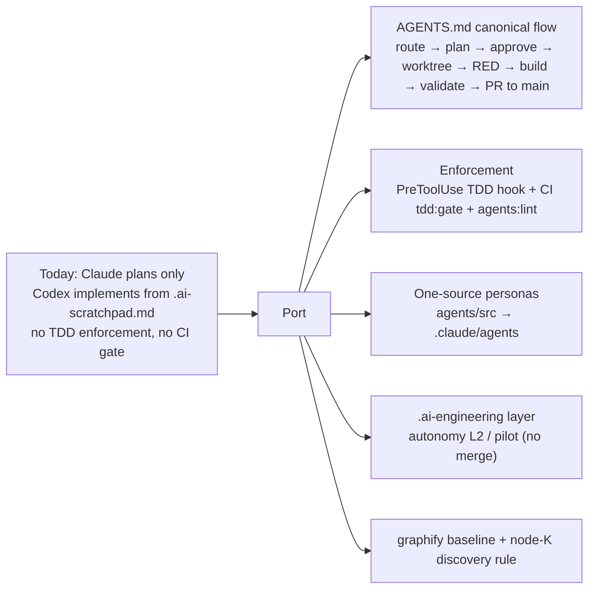

# Port Claude Code engineering workflow → Tyvera

We're bringing the reference repo's way of working into this repo. Every task gets routed, planned, approved, built in its own worktree, tested first (TDD), validated, and handed off. Right now this repo makes Claude plan only and Codex write the code (through `.ai-scratchpad.md`). You told me to drop that and do it all here, so Claude will plan and implement. Hooks and a new CI workflow enforce the rules. Personas are generated from one source of truth, for Claude only (your decision).

## Flowchart



## Task metadata

- Classification: `INFRASTRUCTURE` · `LARGE` · AI workflow / tooling · Risk HIGH (CI + agent permissions; no app runtime code changes)
- Docs loaded: reference `planning.md, plan-template.md` (this repo copies are created by this task)
- Detected running model: `claude-opus-5-5`
- Every phase: `claude-opus-5-5`, high. The pair never changes, so the phases run straight through with no switch stop.
- Branch / worktree: `infra/no-ticket-workflow-port-v2` → `.claude/worktrees/infra-workflow-port-v2`, created from `origin/main` @ `bdf6e70`
- Release path: one branch → one PR into `main`, merge commit. Evidence: the only branches are `main`, `codex/*`, `feat/*`, `fix/*` and `infra/*`, and `deploy.yml` deploys to production on push to `main`. The PR is created but not merged, per the reference's autonomy Level 2.
- Claims reversed while investigating:
  1. "packages/admin-database exists" (from your notes): not found. Only `packages/{config,database,types,ui}` exist, so personas target `packages/database` only.
  2. "This session can run the port": false at first, because the deny list blocked Bash. Your commit `bdf6e70` removed it.

## Decisions recorded (yours)

| Topic | Decision |
|---|---|
| Claude-plans / Codex-implements split | **Dropped (option a)**. Claude implements in its own worktree. `.ai-scratchpad.md` gate retired. |
| Codex runtime | **Claude-only**. The generator emits `.claude/agents/*.md` only. `.codex/instructions.md` is kept as a pointer to `AGENTS.md`. |
| Unblock | You edited primary settings (`bdf6e70`, already on `origin/main`). |
| Graphify | Build the baseline in this task and commit `graph.json` and the report. Internals get gitignored. |
| `docs-governance.spec.ts` | Rewrite it to assert the new model. It becomes this task's RED. |

## Leftover worktree (shown, untouched)

`.claude/worktrees/infra-claude-workflow-port` is on branch `infra/no-ticket-claude-workflow-port` at `b10e8c9`, with 0 commits ahead of main. Its only change is uncommitted:

```diff
-  "permissions": { ...allow scratchpad..., "deny": ["Bash","NotebookEdit","Agent","mcp__*"] },
-  "hooks": { PreToolUse Edit|Write → python scratchpad-only guard }
+  "permissions": { "defaultMode": "plan", "disableBypassPermissionsMode": "disable", "disableAutoMode": "disable" }
```

I won't reuse, reset or delete it. The new worktree gets a different name.

## RISK found during discovery

- **`.claude/settings.json` on main (`bdf6e70`) is invalid JSON.** There's a trailing comma after the `allow` array (`JSONDecodeError line 10 col 6`). Claude Code probably ignores the whole file, and that is why Bash now works. The scratchpad-only hook is still in the file and would come back as soon as someone fixes the comma. This PR replaces the file with valid JSON (Phase 2).
- A pre-existing red test, not caused by this task (from reading the code; Phase 0 confirms by running it): `apps/api/src/test/deploy-workflow-governance.spec.ts` expects `timeout-minutes: 35`, `command_timeout: 30m` and `legacy_project=…`, but `deploy.yml` has 50, 45m and `-p this repo`. It stays out of scope, since you said don't touch deploy.yml. I report it, and CI does not run `bun run test`, so it can't block every PR.
- `docs-governance.spec.ts` is also red today (AGENTS.md text, the docs/ai file count, the JSON parse of settings). Phase 1 rewrites it.

## Gap matrix

Conflicts first (your notes, item 6):

| Reference artifact | Exists here? | Action | Stack substitution |
|---|---|---|---|
| Claude implements in worktree | CONFLICT: CLAUDE.md is planner-only; `.codex/instructions.md` is executor-only; `.ai-scratchpad.md` | **adapt → option (a)**: rewrite CLAUDE.md, turn `.codex/instructions.md` into a pointer, delete `.ai-scratchpad.md`, rewrite `docs-governance.spec.ts` | Backwards-compatibility rule, drift markers and the Deep list all move into the new docs |
| docs/ai existing 14 files | yes | **merge** (additive; nothing valid dropped) | see docs rows below |
| `.cursorrules`, `.github/copilot-instructions.md` | yes. Both point at missing docs (`docs/ai/architecture/*`, `.ai/*`) | **adapt**: keep the file, point it at `AGENTS.md` (fixes the dangling paths) | — |
| `.husky/pre-commit` (empty; `core.hooksPath=.husky/_`) | yes | **merge**: run `agents:lint` when persona files are staged | reference used `scripts/git-hooks`; this repo uses husky |
| `scripts/update-ai-indexes.ts`, `scripts/check-assistant-context-governance.ts` | yes | **wire**: referenced from `handoff.md` docs-sync + Completion Gate; code unchanged | — |

System parts:

| Reference artifact | Here? | Action | Substitutions |
|---|---|---|---|
| `AGENTS.md` (principles, canonical flow A–Z, node rules, routing default, dev-env pointer, caveman + persona blocks) | yes (10-line load list) | **merge/rewrite**, keeping the backwards-compat rule + load list | persona line: "self-hosted Next.js 16 + NestJS 10 API, Drizzle/Postgres 16, Docker on a VPS"; `npm`→`bun run`; node W → PR to `main`; drop the `TAR-####` block; the Next.js docs note is kept only if `node_modules/next/dist/docs` exists (checked in Phase 4) |
| `CLAUDE.md` (`@AGENTS.md` + facts) | yes | **rewrite**, keeping the Git Remote section + drift markers | Facts come only from: root/app `package.json`, `turbo.json`, `docker-compose*.yml`, `deploy.yml`, `packages/database/drizzle.config.ts`, README "Developer Quick Context", git remote/branches |
| `AI_WORKFLOW.md`, `PLANNING_STANDARDS.md` | no | **create** stubs → docs/ai/* | graphify gate kept |
| docs/ai phase docs: planning, plan-template, execution, handoff, agent-orchestration, operating-contract, autonomous-engineering, dev-environment, pr-evidence | no | **create (adapt)** | Supabase discipline → "Drizzle/Postgres discipline" (explicit columns, `.limit`, no N+1, transactions). Migrations rule → Drizzle (`packages/database/drizzle/*.sql`, `bun run db:generate`, applied by `packages/database/scripts/migrate.ts`; additive, backward compatible, code works without it; no RLS rules because the code has no RLS). i18n / Spanish UI / idb-cache sections dropped (Tarraula-only). `autonomous-engineering.md` keeps risk tiers, pilot mode, lifecycle and repair policy, with task source and scheduler marked **NOT CONFIGURED** (no Obsidian/TAR). `dev-environment.md` built from `docker-compose.yml` + README + `deploy.yml` (VPS over SSH, `pg_dump` backup before deploy). `pr-evidence.md` without Playwright (vitest + jsdom) |
| `docs/ai/task-router.md` | yes | **merge**: add enums, skill map, required analysis for PERF/INFRA/DOCS; keep this repo's Deep list, drift rules, backwards-compat field; classification block = union of both | — |
| `docs/ai/testing-strategy.md` | yes | **merge**: add "Strict TDD" and "Mandatory Test Layers" (unit + regression + smoke; no e2e layer, since there is no Playwright), plus targeted runs (`../../node_modules/.bin/vitest run <file>` from the workspace); keep the backwards-compat step + verified commands | — |
| entry-point, context-refresh, module-ownership-map, risk-register, architecture-manifest, contracts/*, file-index/repository-map, prompts/* | yes | **merge**: entry-point swaps "Split Brain" for a flow pointer; prompts swap the "scratchpad handoff" for "plan → `docs/plans/<branch>.md`"; maps add rows for the new files only | — |
| `.ai-engineering/` (agents, config, core, memory, runtime/{claude,codex,scheduler}, templates, validation, workflows, SETUP.md) | no | **create (adapt)** the reference's actual layout | `config/autonomous-engineering.yaml`: `autonomy_level: 2` (implement + open PR, never merge = the reference's pilot default); `runtime/codex.md` notes Claude-only personas; memory seeded with verified this repo facts only. **Deviation:** the reference never installed `AUTONOMOUS_ENGINEERING_BOOTSTRAP.md`'s full inventory (manifest.yaml, rules/, schemas/, fingerprint, schedules). I follow the layout the reference actually uses and you listed. Bootstrap invariants AE-001..015 get folded into `core/safety.md`. |
| Personas: `agents/src/*.agent.mjs` + prompts → `scripts/generate-agent-defs.mjs` (+test) | no | **create** | 9 personas: `project-manager`, `database-architect` (owns `packages/database/src/schema/**`, `packages/database/drizzle/**`, `packages/database/scripts/**`, `packages/database/drizzle.config.ts`), `nestjs-api-dev` (owns non-test `apps/api/src/**` + `packages/types/src/**` as the shared contract, per the reference's ownership rule 3), `nextjs-frontend-dev` (owns `apps/web/src/{app,components,hooks,lib}/**`), plus `code-reviewer`, `security-auditor`, `test-engineer`, `ui-ux-designer`, `accessibility-auditor`. Claude model alias `sonnet` (as reference). Codex rendering **removed** (your decision). |
| Strict TDD: hook + `scripts/ci/{tdd-lib,tdd-red,tdd-gate,tdd-runner,test-repo}.mjs` + tests | no | **create (port)** | see "TDD port" |
| `scripts/ci/verified-tree.mjs` | — | **skip**: it caches per tree in a self-hosted runner dir (`/var/lib/tarraula-ci`); this repo CI is a GitHub-hosted runner, and with main-only there are no promotion PRs to deduplicate | — |
| `.github/workflows/ci.yml` | no | **create** a new file; `deploy.yml` untouched | see "CI" |
| `scripts/new-task-worktree.sh` + gitignored `.claude/worktrees/` | no / not ignored | **create** + `.gitignore` line | types `fix|feat|refactor|perf|infra|docs`, base `origin/main` |
| graphify node K + plan/closeout phases | installed (`graphify --help` OK); no `graphify-out/` | **port rule**; build the baseline in Phase 7 | augmentation scripts: **none carried** (`db_bridge`/`pg_objects` = Supabase SQL, `route_map` = Next routes + Tarraula zones, `i18n_namespaces` = es.json). Revisit after the baseline if Nest controllers or the Drizzle schema show gaps |

## TDD port (stack substitutions)

- `isGuardedSource(rel)`: `^(apps/(web|api)|packages/[^/]+)/src/.+\.tsx?$`, excluding `*.test.*`, `*.spec.*`, `*.d.ts` and `*/src/test/**` (test setup).
- Test kinds: `webTests` = `apps/web/src/**/*.{test,spec}.{ts,tsx}`, `apiTests` = `apps/api/src/**/*.{test,spec}.ts`, `typesTests` = `packages/types/src/**/*.{test,spec}.ts`, `scriptTests` = `scripts/**/*.test.mjs`. `migrations` = `packages/database/drizzle/*.sql`, which needs a `Migration-Waiver:` because there is no migration-test infrastructure (stated in testing-strategy). A `.tsx` change needs a runnable test, **not** e2e.
- Runner: vitest workspaces run `<root>/node_modules/.bin/vitest run --reporter=json --outputFile=<tmp> <files relative to workspace>` with `cwd` = workspace. The binary is verified: vitest 3.2.4, hoisted at root. Script tests use `node --test --test-reporter=tap`. `parseTapFailures` is kept for scripts. The new `parseVitestJson` maps failed `assertionResults[].title` → testLevel, and a failed file with 0 assertions → fileLevel. `judgeRed`, `checkTitles`, `extractTestTitles` (handles `it(`) and case ordering are kept verbatim.
- `tdd-gate`: `PROMOTION_REFS = ["main"]`. Messages go to English (the reference used Spanish).
- Root `package.json` scripts, additive: `"agents:generate": "node scripts/generate-agent-defs.mjs"`, `"agents:lint": "node scripts/generate-agent-defs.mjs --check"`, `"tdd:red": "node scripts/ci/tdd-red.mjs"`, `"tdd:gate": "node scripts/ci/tdd-gate.mjs"`, `"test:scripts": "node --test \"scripts/**/*.test.mjs\""`. They're invoked as `bun run …`. No new dependencies.
- `.claude/settings.json`, full new content (valid JSON; `settings.local.json` untouched):

```json
{
  "$schema": "https://json.schemastore.org/claude-code-settings.json",
  "permissions": {
    "defaultMode": "plan",
    "disableBypassPermissionsMode": "disable",
    "disableAutoMode": "disable"
  },
  "hooks": {
    "PreToolUse": [
      {
        "matcher": "Edit|Write|MultiEdit|NotebookEdit|Bash",
        "hooks": [
          { "type": "command", "command": "node \"$CLAUDE_PROJECT_DIR/scripts/hooks/tdd-red-guard.mjs\"" }
        ]
      }
    ]
  }
}
```

## CI (`.github/workflows/ci.yml`, new)

On `pull_request`, with `concurrency` keyed on the ref. One job on `ubuntu-latest`, `timeout-minutes: 15`, steps:
1. checkout with `fetch-depth: 0`
2. `oven-sh/setup-bun@v2` with `bun-version: 1.2.22` (the local version; `packageManager: bun@1.0.0` can't read `bun.lock`)
3. `actions/setup-node@v4` with node 22
4. `bun install --frozen-lockfile`
5. TDD gate (`TDD_GATE_BASE=origin/${{ github.base_ref }}`, `TDD_GATE_HEAD_REF`, `PR_BODY`) → `bun run tdd:gate`
6. `bun run test:scripts`
7. `bun run agents:lint`, only when `agents/src/`, `scripts/generate-agent-defs.mjs` or `.claude/agents/` changed

`typecheck`, `lint` and `test` are not added because the baseline is red (see RISK). Adding them is a follow-up.

## Phases (all `claude-opus-5-5`, high)

**Deviation from the reference's literal-block rule:** about 60 new files are ported, and pasting their full text into the plan isn't workable. New files are specified as "port of reference `<path>` + the substitutions above". Literal content is given where the text is fixed (settings.json, package scripts, CI steps). Existing docs are merged additively.

### Phase 0 — Preflight
1. `git fetch origin`. Create the worktree with `git worktree add .claude/worktrees/infra-workflow-port-v2 -b infra/no-ticket-workflow-port-v2 origin/main`, then `bun install --frozen-lockfile` inside it.
2. Baseline, with output recorded: `bun run typecheck`, `bun run lint`, `bun run test` → list the specs that are red before any change.
3. Copy this plan to `docs/plans/infra-workflow-port-v2.md` and commit `docs(ai): approved plan for workflow port`.

Done when the worktree exists, the baseline is recorded and the plan is committed.

### Phase 1 — RED
Write tests before the implementation, with every new title prefixed and ordered `error:` > `edge:` > `regression:` > `happy:`:
- `scripts/ci/tdd-lib.test.mjs`: the reference cases ported to this repo paths, plus:
  - `edge:` dynamic route `apps/web/src/app/intake/[businessId]/x.test.ts` is classified and runnable
  - `error:` vitest JSON with a load failure → fileLevel
  - `edge:` `apps/web/src/test/setup.ts` is not guarded
- `scripts/ci/tdd-red.test.mjs`, `scripts/ci/tdd-gate.test.mjs`, `scripts/hooks/tdd-red-guard.test.mjs`: ports of the reference integration tests using `scripts/ci/test-repo.mjs` (a disposable git repo whose fixture is an `apps/web` vitest workspace with a symlinked root `node_modules`).
- `scripts/generate-agent-defs.test.mjs`: port, Claude-only, with these cases:
  - `error:` a stale generated file fails `--check`
  - `error:` duplicate `ownedGlobs` fails
  - `error:` an orphan `.claude/agents/*.md` fails
- `apps/api/src/test/docs-governance.spec.ts` rewritten, with these cases:
  - `error:` settings.json parses and has no scratchpad-only hook
  - `error:` `.ai-scratchpad.md` is absent
  - `edge:` CLAUDE.md's first line is `@AGENTS.md`
  - `happy:` AGENTS.md has the "Canonical Task Flow" + `docs/ai/task-router.md`
  - `happy:` the required docs/ai file set exists
  - `happy:` the existing `check:assistant-context-governance` assertions are kept
- Run `node --test "scripts/**/*.test.mjs"` (fails: modules missing) and `cd apps/api && ../../node_modules/.bin/vitest run src/test/docs-governance.spec.ts` (fails). Paste the output. Commit `test(ai-workflow): RED for TDD tooling, agent generator, governance`.

### Phase 2 — Tooling GREEN
`scripts/ci/{tdd-lib,tdd-runner,tdd-red,tdd-gate,test-repo}.mjs`, `scripts/hooks/tdd-red-guard.mjs`, `scripts/generate-agent-defs.mjs`, `scripts/new-task-worktree.sh` (executable), root `package.json` scripts, `.claude/settings.json`, `.gitignore` += `.claude/worktrees/`, `.husky/pre-commit`, `.github/workflows/ci.yml`. Run `bun run test:scripts` → green. Commit per logical unit.

### Phase 3 — Personas
`agents/src/*.agent.mjs` + `agents/src/prompts/*.md` (9, adapted to NestJS/Drizzle/Next 16). `GLOBAL_POLICY` carries caveman ultra, the persona line, graphify-first, the AGENTS flow, `.ai-engineering` reads and the migration rule, with no Tarraula names. Then `bun run agents:generate` → `.claude/agents/0N-*.md`; nothing pre-exists there, so there's no collision. Commit.

### Phase 4 — Root + docs/ai
AGENTS.md, CLAUDE.md, AI_WORKFLOW.md, PLANNING_STANDARDS.md, the new docs/ai files, the merges into the existing ones, `.codex/instructions.md` pointer, `.cursorrules` + `.github/copilot-instructions.md` pointers, `git rm .ai-scratchpad.md`. `docs-governance.spec.ts` → green. Commit.

### Phase 5 — `.ai-engineering/`
Port the reference layout with this repo facts and `autonomy_level: 2`. Run `validation/bootstrap-check.md` manually. Commit.

### Phase 6 — Validation (real runs, output shown)
- `bun run agents:generate`, then `git diff --exit-code .claude/agents`, then `bun run agents:lint` → clean
- `bun run test:scripts` → pass
- Hook proof in a disposable detached worktree (scratchpad dir, `node_modules` symlinked):
  1. Pipe an Edit JSON for `apps/web/src/lib/x.ts` into `node scripts/hooks/tdd-red-guard.mjs` → exit 2
  2. Add a failing `error:` spec, run `bun run tdd:red` → exit 0
  3. Pipe the same JSON again → exit 0
  4. Remove the scratch worktree (created only for this proof)
- `TDD_GATE_BASE=origin/main bun run tdd:gate` → pass
- `bun run typecheck`, `bun run lint`, `bun run test` → no new failures vs the Phase 0 baseline
- Dangling-link check: a one-off `node -e` scan of every backtick/markdown path in `AGENTS.md`, `CLAUDE.md`, `docs/ai/**`, `.ai-engineering/**`, `agents/src/prompts/**` → all resolve (no new repo file)
- `bun run check:assistant-context-governance` → pass
- Review: `ecc:code-review` on the diff

### Phase 7 — Graphify baseline + closeout
Load the `graphify` skill and run `/graphify .` (full run, because this is the first baseline; there is no `graphify-out/`). Add `graphify-out/.gitignore` with the reference's ignore rules. Commit `graph.json`, `GRAPH_REPORT.md` and `manifest.json`. Report nodes/edges and semantic tokens (actual, or a labelled estimate).

### Phase 8 — Handoff
1. Refresh `docs/ai/file-index/repository-map.md` + `architecture-manifest.md` for the new files.
2. `git fetch` + rebase on `origin/main`, then rerun Phase 6.
3. `gh auth switch --hostname github.com --user OwlRepo`, then push and `gh pr create --base main`. Title and body in Spanish + English, in plain language, with the `pr-evidence.md` sections. No Co-Authored-By trailer.
4. `gh pr checks`. **Not merged.**
5. Final report with the status block.

## Rollback
It's all additive files plus doc/config edits in one PR. To undo: revert the merge commit. The only behavior-affecting pieces are the `.claude/settings.json` hook and `ci.yml`. Nothing touches app runtime or the DB.

## Backwards compatibility
There is no app/API/DB/tenant change. Governance changes on purpose (Claude implements; the scratchpad gate is retired). You approved this in chat, so it's not a `BREAKING CHANGE` to any tenant or integration.

## Open items (non-blocking)
- **UNVERIFIED:** `bun install --frozen-lockfile` on the GitHub runner. The PR's first CI run proves it.
- Follow-up (separate task): fix the `deploy-workflow-governance.spec.ts` vs `deploy.yml` drift, then add typecheck/lint/test to CI.

## Phase 0 baseline (recorded 2026-10-01, origin/main bdf6e70)

- `bun run typecheck`: exit 0.
- `bun run lint`: exit 1 — pre-existing `apps/web` error (setState synchronously within an effect) + 19 warnings.
- `apps/web` vitest: 11 failed / 230 passed — `tyvera-assistant-orchestration.test.tsx` (1), `appointments/page.wizard.test.tsx` (10).
- `apps/api` vitest: 9 failed / 591 passed / 3 skipped — `assistant-mutation.service.spec.ts`, `assistant-read-model.service.spec.ts`, `deploy-workflow-governance.spec.ts` (3), `docs-governance.spec.ts` (3, rewritten by this task), `rebrand-governance.spec.ts` (1: legacy brand string in `deploy.yml` and `CLAUDE.md`).
- `packages/types` vitest: 11 passed.
- Consequence: new docs must not contain the legacy brand string (`rebrand-governance.spec.ts`).

## Execution amendments (from the Phase 6 review)

- `tdd-gate` no longer skips PRs whose head branch is named `main` (the planned `PROMOTION_REFS = ["main"]`): this repo has no promotion PRs, and a fork's `main` could have bypassed the gate. `TDD_GATE_HEAD_REF` is no longer passed by CI.
- `isGuardedSource` covers `apps/web`, `apps/api`, `packages/types` only: `packages/database` and `packages/ui` have no vitest runner, so guarding them would block edits no test can unblock.
- The base-run worktree also symlinks per-workspace `node_modules`, so a missing non-hoisted dependency cannot fake a RED.
- `tdd:red` records the HEAD SHA; on a detached HEAD the hook accepts the marker only at that commit.
- CI passes `github.base_ref` to the agents-lint step through `env:`.
